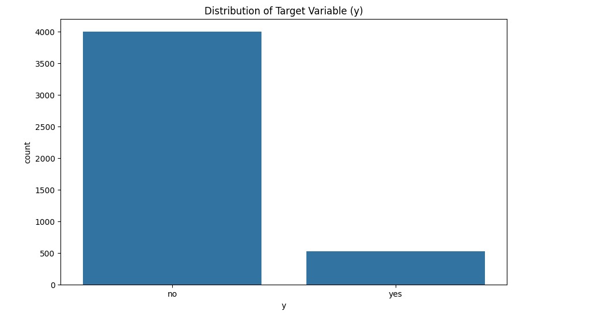
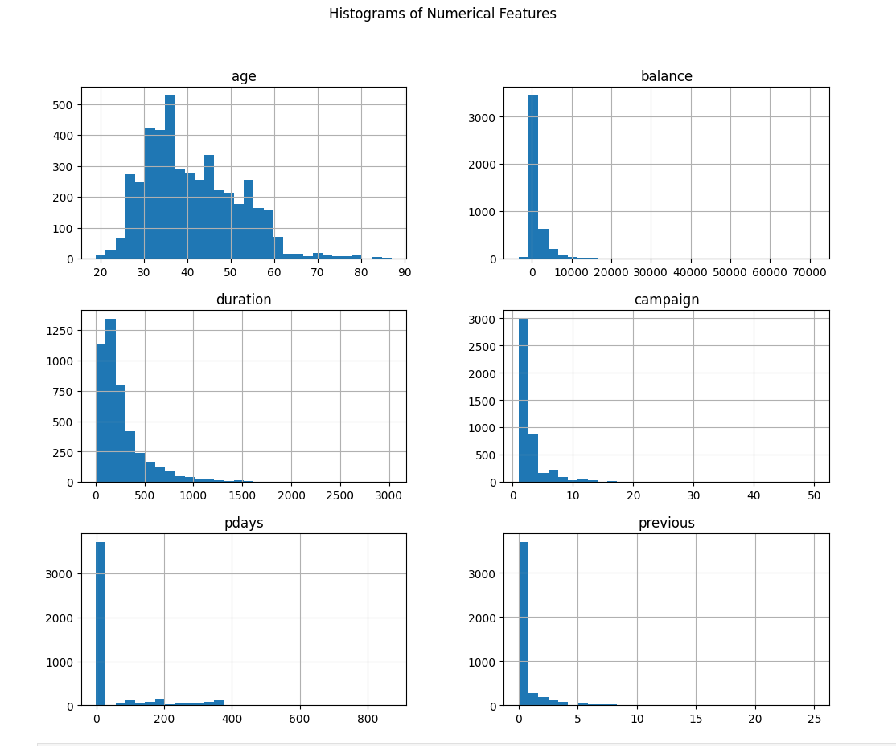
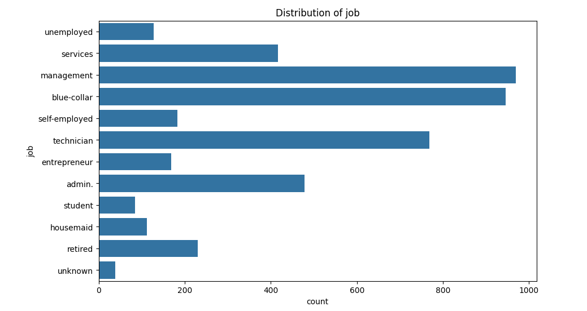
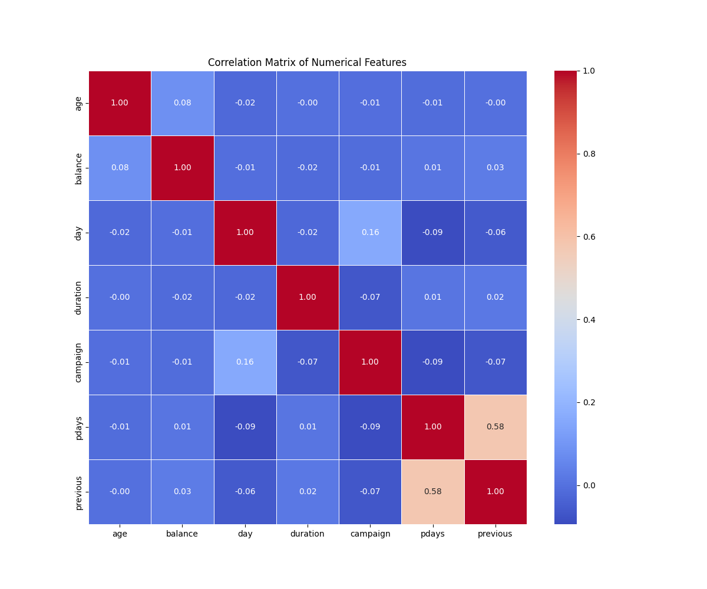

# Predicting Bank Term Deposit Subscriptions: A Machine Learning Approach

In the world of banking, direct marketing campaigns play a crucial role in acquiring new customers and boosting financial product subscriptions. However, predicting which clients are most likely to subscribe to a term deposit can be challenging. In this blog post, I’ll walk you through a project where we tackled this problem using machine learning techniques to improve marketing strategies and optimize customer outreach.

## Motivation

Our objective was to build a predictive model to determine whether a client will subscribe to a term deposit based on a set of features provided by a Portuguese bank’s marketing campaign. With a focus on precision and recall, we aimed to enhance the efficiency of marketing efforts and maximize subscription rates.

## Data Overview

The dataset used for this project, sourced from a public repository created by Paulo Cortez and Sérgio Moro, contains detailed records of a bank's marketing campaigns. Key features include:

- **Client Attributes**: Age, job, marital status, education, credit default, balance, housing loan, and personal loan.
- **Contact Information**: Type of communication, contact day, contact month, duration of the last contact, and number of contacts performed during the campaign.
- **Previous Campaign Data**: Outcome of previous marketing efforts.

### Key Attributes:

- **Age**: Numerical value representing the client's age.
- **Job**: Categorical value indicating the client’s profession.
- **Marital Status**: Client’s marital status.
- **Balance**: Average yearly balance in euros.
- **Duration**: Duration of the last contact in seconds.
- **Poutcome**: Outcome of the previous marketing campaign.

## Visualizations

### Target Variable Distribution

The distribution of the target variable, which indicates whether a client subscribed to a term deposit or not, is shown below. This visualization helps in understanding the class imbalance in the dataset.

## Histograms of Numerical Features

Visualizing the distribution of numerical features helps in understanding their range and frequency. Below are histograms for key numerical features in the dataset.

## Distribution of Job Types

The distribution of job types among the clients provides insights into the diversity of professions in the dataset. The bar plot below shows the frequency of each job type recorded in the data.

## Correlation Analysis

Understanding the relationships between numerical features helps in feature selection and improving model performance. Below, we provide a detailed analysis of the correlations within the dataset.

### Interpretation

From the correlation analysis:
- **Age** and **balance** show moderate correlations with the target variable, suggesting these features might have some impact on subscription likelihood.
- **Duration** of the last contact has a strong positive correlation with the target variable, indicating that longer contact durations are strongly associated with subscription success.
- Other features like **campaign** and **previous** show weaker correlations with the target variable, indicating less direct influence on the likelihood of subscription.

Understanding these relationships helps in feature engineering and model tuning, allowing us to focus on the most relevant features for improving model performance.

## Methodology

### Data Exploration and Preprocessing

Before diving into model building, we performed an in-depth data exploration:

- **Data Cleaning**: Checked for missing values and handled them appropriately.
- **Feature Analysis**: Analyzed the distribution and significance of each feature.
- **Class Imbalance**: Addressed the imbalance between the subscribed and non-subscribed classes using techniques like SMOTE.

### Model Selection

We evaluated several machine learning models:

1. **Logistic Regression**: A simple yet effective model for binary classification problems.
2. **Decision Tree**: A model that splits data based on feature values to make predictions.
3. **Random Forest**: An ensemble method combining multiple decision trees to improve performance.
4. **Gradient Boosting**: An advanced technique that builds models sequentially to correct errors from previous models.
5. **Support Vector Machine (SVM)**: A powerful classifier that works well with high-dimensional spaces.

### Model Performance

The following metrics were used to evaluate model performance:

- **Accuracy**: The proportion of correctly classified instances.
- **Precision**: The proportion of true positives out of all positive predictions.
- **Recall**: The proportion of true positives out of all actual positives.
- **F1 Score**: The harmonic mean of precision and recall.

**Performance Summary:**

| Model                  | Accuracy | Precision | Recall  | F1 Score |
|------------------------|----------|-----------|---------|----------|
| Logistic Regression    | 0.898    | 0.581     | 0.329   | 0.420    |
| Decision Tree          | 0.864    | 0.394     | 0.401   | 0.397    |
| Random Forest          | 0.898    | 0.617     | 0.243   | 0.349    |
| Gradient Boosting      | 0.895    | 0.554     | 0.336   | 0.418    |
| Support Vector Machine | 0.888    | 0.000     | 0.000   | 0.000    |

**Best Parameters for Random Forest:**

- `max_depth`: 20
- `n_estimators`: 50

**Best F1 Score Achieved:**

- **0.376**

## Key Insights and Conclusion

In this blog post, we delved into the correlation analysis of the dataset used for predicting term deposit subscriptions. By examining the relationships between numerical features and their association with the target variable (`y`), we uncovered several valuable insights:

1. **Strong Impact of Contact Duration:**
   - The duration of the last contact is the feature most strongly correlated with the likelihood of a client subscribing to a term deposit. This suggests that longer interactions with clients significantly increase the probability of a successful subscription. This insight can be crucial for designing effective marketing strategies.

2. **Moderate Influence of Age and Balance:**
   - Both the client’s age and their average yearly balance show moderate correlations with the target variable. This indicates that while these factors do affect subscription likelihood, they are less influential compared to the contact duration. These features should still be considered but may not be as critical as the contact duration.

3. **Weaker Associations:**
   - Features such as the number of contacts performed during the campaign and the number of contacts performed before this campaign exhibit weaker correlations with the target variable. This suggests that these variables have a less direct influence on subscription success. 

4. **Categorical Data Considerations:**
   - The initial analysis focused on numerical features. However, incorporating encoded categorical features into the correlation analysis could provide a more comprehensive view of how categorical variables interact with numerical features and affect the target variable.

### Conclusion

Correlation analysis provides a foundation for understanding the relationships within the dataset and identifying which features are most predictive of a positive outcome. By focusing on features with strong correlations, such as the duration of contact, we can prioritize efforts and resources in areas that are likely to yield the best results. 

The insights gained from this analysis are not only valuable for improving marketing strategies but also serve as a guide for feature selection in model building. This approach ensures that the most impactful features are leveraged to enhance model performance and achieve more accurate predictions.

Future work may involve a deeper exploration of categorical features, more sophisticated feature engineering, and the application of advanced modeling techniques to further refine predictions and optimize marketing campaigns.

We hope this analysis helps in better understanding the factors influencing subscription success and provides a pathway to more effective and targeted marketing strategies.
